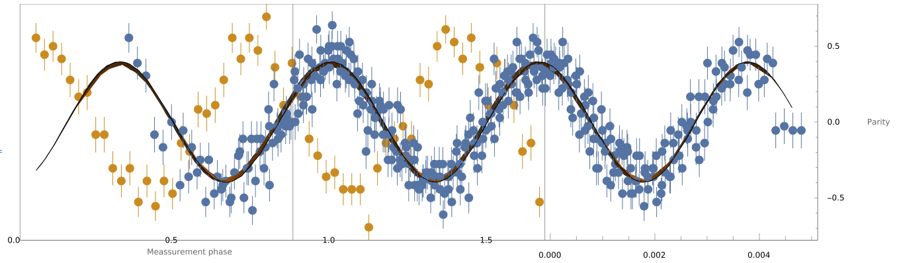
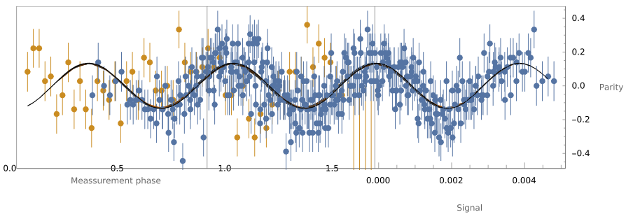
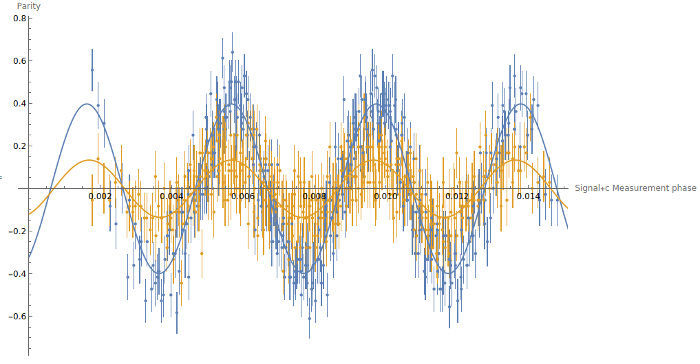

# Advantage of entangled Sensors

In the presense of strongly correlated noise entangled states lead to bedder estimations then product states.
We will show this in three steps:
- Entangled states have a higher amplitude (visibilty/contrast) for parity meassurements.
- Parity meassurements are optimal within the DFS.
- The correlated noise outside the dfs is fully dephasing, meaning that information extractable outside the DFS is neglegtable
Finally notice, that a higher amplitude (visibilty/contrast) directly corresponds to a bedder estimation.
This can be understood as the amplitude can be reduced by adding signal independent random outcomes (local noise), which must not improve your estimation.
More details and different arguments from different perspectives are in the appendix.

## Higher amplitude and contrast for parity meassurements

For each state (entangled, product) the parity was meassured with respect 60 different phases (see appendix:meassuremnt_phase) and 6 different signals
- -27.5db
- -25.5db
- -24.5db
- -24db
- -23.5db
- -23db
and without signal.
At each of the $`7*60=420`$ setting the parity was obtained by averaging of 72 shots.

We obtained the amplitude $`A`$ by fitting $$ A*Cos\left(\omega_s s + \omega_p p +\phi\right),$$
the signal $`\omega_s`$ and phase $`\omega_p`$ frequencies for given signal $`s`$ and phase $`p`$.

**Engangled state**
{width=75%}
We see the data and the fit for the entangled state.
The fit parameters are:

|              | Estimate | Standard Error | t-Statistic | P-Value         |
| ------------ | -------- | -------------- | ----------- | --------------- |
|     $`A`$    | -0.39782 |   0.00931523   |  -42.7064   | 3.8275*10^-142  |
| $`\omega_s`$ |  1550.78 |      22.8314   |   67.9231   | 7.17197*10^-206 |
| $`\omega_p`$ |  9.49532 |    0.0519941   |   182.623   | 0.              |
|    $`\phi`$  | -5.64658 |    0.0952608   |   -59.275   | 1.59131*10^-186 |

{width=75%}
The data without signal was not used, they are not aligned as visible.

**Product state**
{width=75%}
We see the data and the fit for the product state.
The fit parameters are:

|              | Estimate | Standard Error | t-Statistic | P-Value         |
| ------------ | -------- | -------------- | ----------- | --------------- |
|     $`A`$    | 0.134318 |   0.00788734   |   17.0296   | 5.42228*10^-48  |
| $`\omega_s`$ |  1578.91 |      57.1486   |   27.6282   | 1.42179*10^-90  |
| $`\omega_p`$ |  9.44964 |     0.130336   |   72.5019   | 2.80494*10^-215 |
|    $`\phi`$  | -8.94005 |     0.239125   |   -37.3866  | 2.54995*10^-125 |

{width=75%}
The data without signal was not used, they are not aligned as visible.

**Comparision**
As we have now a good understanding of relation between parity signal and meassuremnt phase, we can reduce the 3d plot to a 2d plot and compare the entangled and the product state.
{width=75%}
This plots shows the response of the sensor, i.e. the parity as a function of the signal plus $`c=\frac{\omega_p}{\omega_s}`$ times the meassurment phase. We clearly see that the entangled state has the higher amplitude (contrast/visibilty). This implies that signal changes are easier to detect as the same change leads to higher changes in the parity. Therefore the sensor is more sensitive.

## Parity meassurements are optimal within the DFS
Next you might ask, if there might be a bedder meassurement, which could potentialy be benefical for the product state.

## Only neglegtable Information outside the DFS

# Appendix

## Higher ampliude implies bedder estimations

### Adding noise is equivalent to reducing ampliude

### Quantum Fisher Information perspective

### Linear estimation perspective

# Meassurement phase
